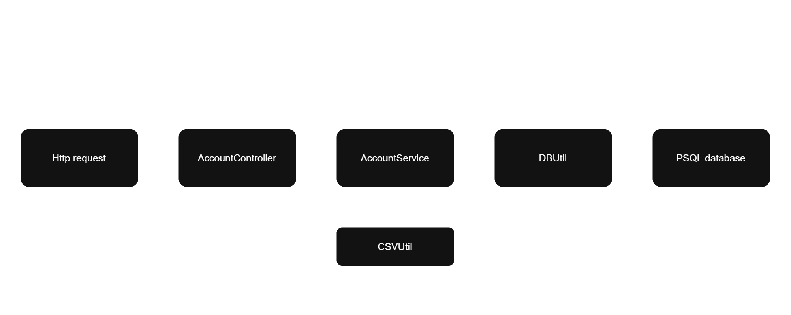

<h1>Architecture diagram</h1>

<h1>Usage</h1>

Project is dockerized, run docker compose within project directory.

Swedbank bank statement samples under /samples directory.

<h3>Requests I use : </h3>

/import

http://localhost:8080/api/statements/import

http://localhost:8080/api/statements/import

/export

http://localhost:8080/api/statements/export?accountNumber=LT444555666777888999&from=2024-01-01&to=2024-01-10

http://localhost:8080/api/statements/export?accountNumber=LT444555666777888999

http://localhost:8080/api/statements/export?accountNumber=LT222333444555666777&from=2024-01-01&to=2024-01-10

http://localhost:8080/api/statements/export?accountNumber=LT222333444555666777

/getBalance

http://localhost:8080/api/statements/getBalance?accountNumber=LT444555666777888999&from=2024-01-01&to=2024-01-10

http://localhost:8080/api/statements/getBalance?accountNumber=LT444555666777888999

http://localhost:8080/api/statements/getBalance?accountNumber=LT222333444555666777&from=2024-01-01&to=2024-01-10

http://localhost:8080/api/statements/getBalance?accountNumber=LT444555666777888999

<h1>To do</h1>

Learn about exception handling conventions and implement.

(Re)implement automatic testing

General code improvement

Add more informative comments
